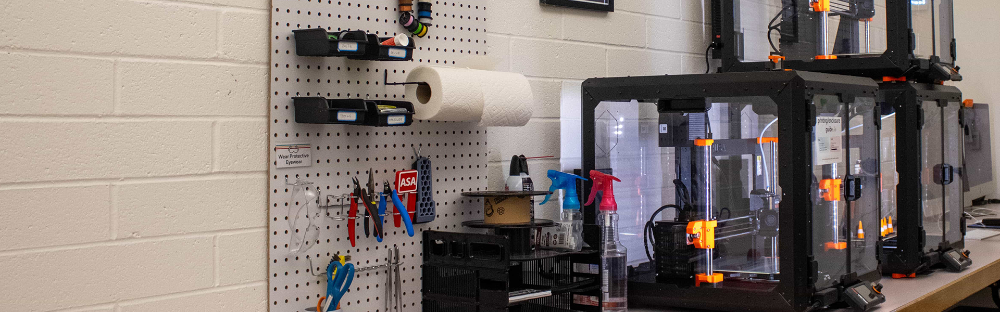

<h1>Welcome to the Mac Lab :wave:</h1>

<code>What is the Mac Lab?</code>

The Mac Lab is a creative space at [BYU-Idaho](https://byui.edu). It is a place where students can come to work on projects, learn new skills, and collaborate with others.

The lab is equipped with Mac computers, the Adobe Creative Cloud suits, and 3D printers. The lab is open to all students, regardless of major.

<code>Where can I learn more?</code>

To learn more about the lab visit the our [website](https://library.byui.edu/maclab).

<code>Lab Services</code>

-   **Skilled help from our staff**
-   [3D Printing](https://library.byui.edu/maclab/pages/3dPrinting.html)
-   [Adobe Creative Cloud](https://library.byui.edu/maclab/pages/adobeHelp.html)
-   [Equipment Checkout](https://library.byui.edu/maclab/pages/equipment.html)
-   [VR Lab](https://library.byui.edu/maclab/pages/vr.html)
